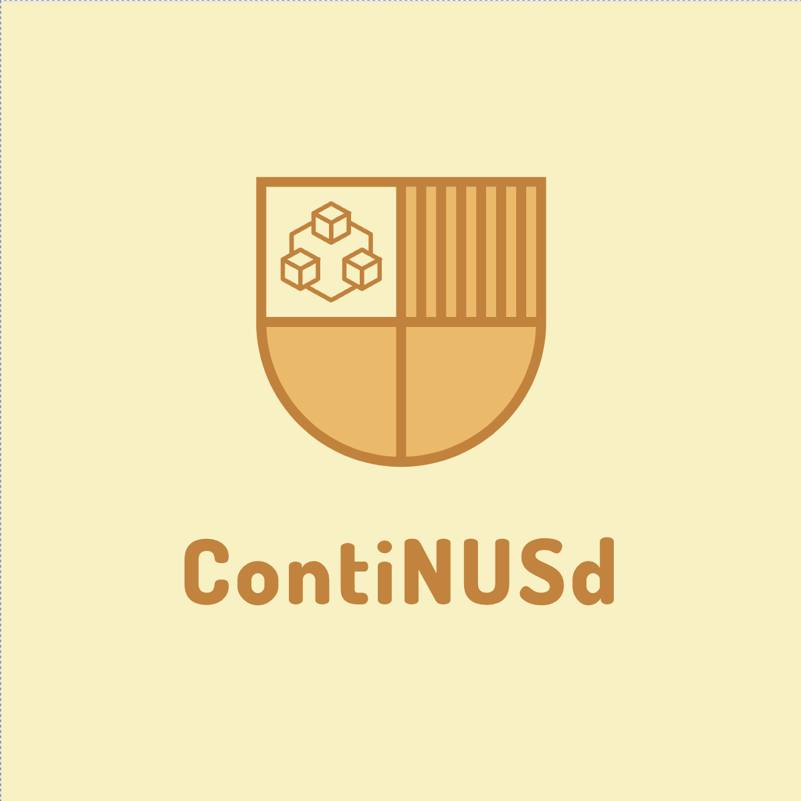

   
  

> ContiNUSd **supercharges** your learning experience in Kubernetes and containerization directly inside VS Code, **unlocking untapped knowledge** in these complex areas. It helps you to **visualize Kubernetes deployments and pods** at a glance, **seamlessly navigate and explore** containerized applications, **gain valuable insights** via rich visualizations and powerful Kubernetes commands, and so much more. Built with learners in mind, ContiNUSd makes mastering Kubernetes and containerization accessible and convenient, all within your familiar VS Code environment.

# Get Started

When your Codespace is all set up, you'll see the VS Code editor on your screen. Hold tight for a moment as your terminal completes its setup - this usually takes around 5 minutes.

After the setup is finished, you're all ready to begin your learning journey. Look for the "CODETOUR" button on the bottom left of your screen and give it a click to get started. Enjoy!